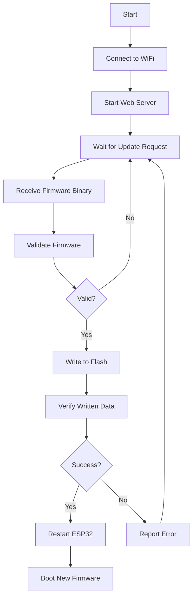

# ESP32 OTA Firmware Update 🚀

A complete Over-The-Air (OTA) firmware update solution for ESP32 microcontrollers, enabling wireless firmware updates through a user-friendly web interface.

[](https://opensource.org/licenses/MIT)
[](https://www.espressif.com/en/products/socs/esp32)

## 📋 Table of Contents

- [Overview](#overview)
- [Features](#features)
- [Hardware Requirements](#hardware-requirements)
- [Software Requirements](#software-requirements)
- [Installation](#installation)
- [Configuration](#configuration)
- [Usage](#usage)
- [Project Structure](#project-structure)
- [OTA Update Process](#ota-update-process)
- [Troubleshooting](#troubleshooting)
- [Security](#security)
- [Contributing](#contributing)
- [License](#license)

## 🎯 Overview

This project provides a robust OTA firmware update mechanism for ESP32 devices, allowing you to update your device firmware remotely over WiFi without physical access. Perfect for IoT devices deployed in hard-to-reach locations.

## ✨ Features

- **Web-Based Upload**: Simple web interface for firmware uploads
- **Wireless Updates**: No USB cable required after initial setup
- **Progress Tracking**: Real-time update progress monitoring
- **Version Management**: Firmware version tracking and display
- **Auto Restart**: Automatic device restart after successful update
- **Error Handling**: Comprehensive error detection and reporting
- **Lightweight**: Minimal memory footprint
- **Easy Integration**: Simple to add to existing ESP32 projects

## 🛠️ Hardware Requirements

- ESP32 Development Board (any variant)
  - ESP32-WROOM-32
  - ESP32-DevKitC
  - ESP32-WROVER
  - NodeMCU-32S
- WiFi Network (2.4 GHz)
- USB Cable (for initial firmware upload only)
- Power Supply (5V via USB or dedicated power source)

## 📦 Software Requirements

### Arduino IDE Setup
- [Arduino IDE](https://www.arduino.cc/en/software) 1.8.x or later
- ESP32 Board Support Package
- Required Libraries:
  - `WiFi` (built-in)
  - `WebServer` (built-in)
  - `Update` (built-in)
  - `ArduinoOTA` (optional, for Arduino OTA)

### PlatformIO Setup
- [PlatformIO](https://platformio.org/) Core or IDE
- Platform: espressif32

## 🚀 Installation

### Step 1: Clone the Repository
```bash
git clone https://github.com/yourusername/esp32-ota-project.git
cd esp32-ota-project
```

### Step 2: Install ESP32 Board Support (Arduino IDE)

1. Open Arduino IDE
2. Go to `File` → `Preferences`
3. Add to "Additional Board Manager URLs":
```
   https://raw.githubusercontent.com/espressif/arduino-esp32/gh-pages/package_esp32_index.json
```
4. Go to `Tools` → `Board` → `Board Manager`
5. Search for "ESP32" and install "esp32 by Espressif Systems"

### Step 3: Open the Project

**Arduino IDE:**
```bash
Open esp32_ota.ino
```

**PlatformIO:**
```bash
code . # or open with your preferred editor
```

## ⚙️ Configuration

### WiFi Configuration

Edit the configuration in your main sketch file:
```cpp
// WiFi Credentials
const char* ssid = "Your_WiFi_SSID";
const char* password = "Your_WiFi_Password";

// OTA Configuration
const char* host = "esp32-ota";  // Hostname for OTA
const int otaPort = 8080;        // Web server port
```

### Partition Scheme

Ensure your ESP32 has enough space for OTA updates:

**Arduino IDE:**
- `Tools` → `Partition Scheme` → Select `Minimal SPIFFS (1.9MB APP with OTA/190KB SPIFFS)`
or
- `Default 4MB with spiffs (1.2MB APP/1.5MB SPIFFS)`

**PlatformIO (platformio.ini):**
```ini
[env:esp32dev]
platform = espressif32
board = esp32dev
framework = arduino
board_build.partitions = min_spiffs.csv
```

## 📱 Usage

### Initial Setup

1. **Connect ESP32** via USB to your computer
2. **Upload the firmware** using Arduino IDE or PlatformIO
3. **Open Serial Monitor** (115200 baud rate)
4. **Note the IP address** displayed after WiFi connection

### Performing OTA Update

1. **Build the firmware binary:**
   
   **Arduino IDE:**
   - `Sketch` → `Export Compiled Binary`
   - Binary will be in the sketch folder: `esp32_ota.ino.esp32.bin`

   **PlatformIO:**
```bash
   pio run
```
   - Binary location: `.pio/build/esp32dev/firmware.bin`

2. **Access the web interface:**
   - Open browser and navigate to: `http://<ESP32_IP_ADDRESS>:8080`
   - Or use hostname: `http://esp32-ota.local:8080` (if mDNS is working)

3. **Upload new firmware:**
   - Click "Choose File" and select your `.bin` file
   - Click "Update"
   - Wait for upload to complete
   - Device will restart automatically

### Expected Serial Output
```
Starting ESP32 OTA Update System...
Connecting to WiFi: Your_WiFi_SSID
WiFi connected!
IP Address: 192.168.1.100
OTA Server started on port 8080
Access web interface at: http://192.168.1.100:8080
```

## 📁 Project Structure
```
esp32-ota-project/
├── esp32_ota.ino          # Main Arduino sketch
├── config.h               # Configuration file
├── web_interface.h        # HTML/CSS for web interface
├── ota_handler.h          # OTA update handler functions
├── platformio.ini         # PlatformIO configuration (if using PlatformIO)
├── README.md              # This file
├── LICENSE                # License file
└── examples/
    └── basic_ota.ino      # Minimal example
```

## 🔄 OTA Update Process


## 🐛 Troubleshooting

### WiFi Connection Issues

**Problem:** ESP32 not connecting to WiFi

**Solutions:**
- Verify SSID and password are correct
- Ensure WiFi is 2.4GHz (ESP32 doesn't support 5GHz)
- Check router settings and firewall
- Try moving ESP32 closer to router
- Reset ESP32 and try again

### OTA Update Fails

**Problem:** Update process fails or device doesn't restart

**Solutions:**
- Check available flash memory space
- Ensure firmware binary is compatible with your ESP32 variant
- Verify partition scheme supports OTA
- Use a stable power supply during update
- Check serial monitor for error messages

### Cannot Access Web Interface

**Problem:** Cannot open web interface in browser

**Solutions:**
- Verify ESP32 IP address from serial monitor
- Ensure computer is on same network as ESP32
- Try using IP address instead of hostname
- Check firewall settings on your computer
- Restart router and ESP32

### Upload Timeout

**Problem:** Browser shows timeout during upload

**Solutions:**
- Use smaller firmware binaries
- Ensure stable WiFi connection
- Try uploading from a device closer to ESP32
- Increase timeout values in code if necessary

## 🔒 Security

### Important Security Considerations

⚠️ **This is a basic implementation. For production use, consider:**

- **Password Protection**: Add authentication to web interface
- **HTTPS**: Use encrypted connections for firmware uploads
- **Firmware Signing**: Verify firmware authenticity before flashing
- **Rollback Mechanism**: Implement automatic rollback on failed boots
- **Access Control**: Restrict OTA access to specific IP ranges
- **Secure Storage**: Encrypt sensitive configuration data

### Adding Basic Authentication
```cpp
// Add to your web server handlers
if (!server.authenticate("admin", "your_password")) {
    return server.requestAuthentication();
}
```

## 🤝 Contributing

Contributions are welcome! Here's how you can help:

1. Fork the repository
2. Create a feature branch (`git checkout -b feature/AmazingFeature`)
3. Commit your changes (`git commit -m 'Add some AmazingFeature'`)
4. Push to the branch (`git push origin feature/AmazingFeature`)
5. Open a Pull Request

### Guidelines

- Follow existing code style
- Add comments for complex logic
- Test thoroughly before submitting
- Update documentation as needed

## 📄 License

This project is licensed under the MIT License - see the [LICENSE](LICENSE) file for details.

## 🙏 Acknowledgments

- [Espressif Systems](https://www.espressif.com/) for ESP32 platform
- [Arduino](https://www.arduino.cc/) community
- All contributors and users of this project

## 📞 Support

- **Issues**: [GitHub Issues](https://github.com/Kingkiri0986/ESP_OTA.git/issues)
- **Discussions**: [GitHub Discussions](https://github.com/Kingkiri0986/ESP_OTA.git/Discussions)
- **Email**: paramtap0809@gmail.com

## 🌟 Star History

If you find this project helpful, please consider giving it a star ⭐

---

**Made with ❤️ for the ESP32 Community**